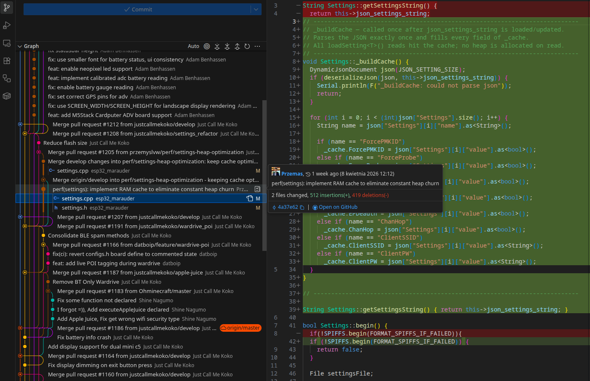

W ramach wsparcia projektu open-source ESP32Marauder zająłem się analizą i przebudową mechanizmu zarządzania ustawieniami urządzenia. Choć z pozoru był to prosty element systemu, jego dotychczasowa implementacja skrywała poważny dług technologiczny, który negatywnie wpływał na działanie całego narzędzia. Postanowiłem to zmienić.

<!-- truncate -->

Poniżej przedstawiam, na czym dokładnie polegała zmiana architektury kodu i dlaczego w systemach wbudowanych (ang. *embedded*) takich jak ESP32, unikanie niepotrzebnych operacji na pamięci ma kluczowe znaczenie.

### Stara architektura: Wzorzec "Read-and-Deserialize"
Przed moimi zmianami system opierał się na architekturze bezpośredniego odczytu z parsowaniem w locie. Każde wywołanie funkcji pobierającej konfigurację, np. `loadSetting()`, powodowało utworzenie obiektu `DynamicJsonDocument` oraz pełną deserializację pliku konfiguracyjnego JSON. 

Ten model sprawdza się w aplikacjach o niskiej częstotliwości odczytu, jednak w ESP32Marauder był wysoce nieefektywny. W trybach aktywnych (takich jak pętle ataków czy sniffing) ustawienia odczytywane były **nawet 20 razy na sekundę**. Konsekwencje takiego podejścia były dotkliwe dla układu o ograniczonych zasobach:
*   **Wysoki "Heap Churn":** Stała, powtarzalna alokacja i dealokacja bloków wielkości około 2 KB generowała ruch w pamięci sterty rzędu ~40-60 KB/s.
*   **Ryzyko "Out of Memory":** Wspomniany *heap churn* prowadził do silnej fragmentacji sterty (heap fragmentation), co groziło nagłymi crashami układu podczas długotrwałych sesji pentestingowych.
*   **Opóźnienia CPU i wejścia/wyjścia (I/O):** Ciągły narzut na system plików SPIFFS oraz procesor, który w pętli parsował ten sam tekst, spowalniał responsywność interfejsu. Również operacje przełączania flag (np. funkcja `toggleSetting()`) marnowały cykle procesora na zbędne parsowanie dokumentu JSON tylko po to, by sprawdzić aktualny stan przełącznika.

### Nowa architektura: Scentralizowany RAM Cache ($O(1)$)
Aby wyeliminować te wąskie gardła, przebudowałem mechanizm tak, aby uniezależnić bieżącą logikę programu od operacji dyskowych. Zamiast ciągłego parsowania plików wprowadziłem nową architekturę – **scentralizowaną pamięć podręczną w RAM**.

**Na czym polega różnica w architekturze?**
1.  **Płaska struktura danych w RAM:** Wewnątrz klasy `Settings` (w pliku `settings.h`) zaimplementowałem strukturę `SettingsCache` przechowującą aktualne flagi konfiguracyjne, takie jak `SavePCAP`, `ForceProbe` czy ustawienia sieciowe `ClientSSID` i `ClientPW`.
2.  **Jednorazowe parsowanie (Inicjalizacja):** Plik JSON z ustawieniami jest pobierany i deserializowany wyłącznie **jeden raz** – w metodzie `begin()`, przy uruchomieniu urządzenia. Odpowiada za to nowa, wewnętrzna metoda `_buildCache()`, która przenosi dane z pliku tekstowego bezpośrednio do struktury w pamięci operacyjnej.
3.  **Odczyt O(1):** Najważniejsza zmiana nastąpiła w metodach dostępowych (`loadSetting()`). Obecnie, po zażądaniu zmiennej typu `bool` (np. `ForcePMKID`), metoda po prostu zwraca wartość ze struktury `_cache`. Przełożyło się to na **zerową alokację na stercie** w trakcie odczytu (zero heap allocation) oraz zniwelowanie czasu dostępu do złożoności $O(1)$.
4.  **Zarządzanie stanem i spójność:** Aby zapobiec sytuacji, w której pamięć RAM zawiera inne dane niż plik w pamięci Flash, zintegrowałem mechanizm odświeżania bufora z metodą `saveSetting()`. Zapis aktualizuje plik i natychmiast synchronizuje *cache*, utrzymując pełną spójność systemu. Funkcja `toggleSetting()` również działa teraz wydajniej – najpierw natychmiastowo weryfikuje aktualny stan w buforze RAM, po czym zleca zmianę.

### Wpływ na stabilność i wydajność
Odejście od naiwnego odczytu na rzecz zarządzania cachem w RAM dało wymierne efekty w działaniu narzędzia:
*   **Całkowita eliminacja zbędnych alokacji sterty (~40-60 KB/s)** i odciążenie procesora, ponieważ logika ataków oraz UI odczytują teraz konfigurację bezpośrednio z pamięci RAM.
*   **Wydłużenie bezawaryjnego czasu pracy.** Usunięcie fragmentacji pamięci drastycznie obniżyło ryzyko błędów typu *Out of Memory*.
*   **Znaczne przyspieszenie działania.** Skrócenie czasu odczytu sprawiło, że zarówno sam interfejs, jak i pętle ataków reagują błyskawicznie.
*   Układy takie jak ESP32-S2/S3 bez problemu potrafią teraz przetrwać długotrwałe, intensywne sesje skanowania i wysyłania pakietów.

Z perspektywy oprogramowania systemów wbudowanych, jest to klasyczny przykład tego, jak przemyślany kompromis (zajęcie ułamka wolnej pamięci RAM przez płaską strukturę w zamian za zwolnienie CPU/IO i ochronę sterty) może fundamentalnie poprawić stabilność projektu.

Zapraszam do zapoznania się ze szczegółami zmian w zgłoszeniu na GitHub: [Pull Request #1205](https://github.com/justcallmekoko/ESP32Marauder/pull/1205#issuecomment-4225971653).

#Cybersecurity #OpenSource #ESP32 #Pentesting #Embedded #Cpp #Optimization #FlipperZero