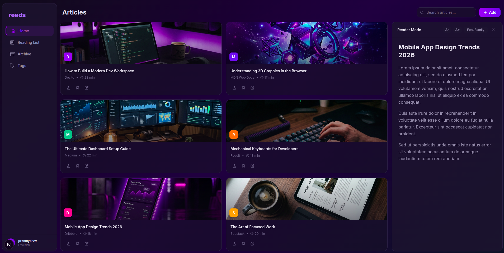

Projekt **reads** ewoluuje. To już nie tylko proste narzędzie do zakładek, ale poligon doświadczalny dla nowoczesnych standardów dostarczania oprogramowania. Choć demo znajduje się obecnie w fazie koncepcyjnej (zarządzanie zakładkami i moduł logowania są w trakcie wdrażania), już teraz możesz zobaczyć, jak realizujemy podejście **Automation First** i **Secure by Design** w praktyce.

**Sprawdź demo (Staging) ↗**](https://reads-staging.baluarte.pl/)

<!-- truncate -->

### CI/CD jako serce projektu
W **reads** automatyzacja to nie dodatek, a wymóg. Każdy Pull Request przechodzi rygorystyczną weryfikację w potokach GitHub Actions, co gwarantuje stabilność nawet w najwcześniejszej fazie rozwoju:

*   **Quality Gates:** Integracja z **SonarQube** oraz testy jednostkowe w **Vitest** blokują regresję długu technicznego.
*   **Automatyzacja Wydań:** Wykorzystujemy **Semantic Release** i **Conventional Commits**. Każda zmiana jest automatycznie wersjonowana, a changelogi generują się bez udziału człowieka.

### Bezpieczeństwo: Architektura Zero Trust
Jako projekt typu self-hosted, **reads** musi być odporny na ataki od pierwszego commita. Nasza strategia bezpieczeństwa obejmuje:

*   **Deep Scanning:** Potrójna weryfikacja obejmująca **CodeQL** (luki w logice), **Secrets Scan** (ochrona kluczy API) oraz **Container Scan** (podatności w obrazach Dockera).
*   **Cloudflare Tunnels:** Środowiska stagingowe działają w modelu **Zero Trust**. Dzięki tunelom Cloudflare komunikacja jest zabezpieczona bez wystawiania portów na świat zewnętrzny.

### Nowoczesny Stack i Monorepo
Architektura oparta na **Monorepo** umożliwia błyskawiczne współdzielenie schematów między API a frontendem w **Next.js**. Pełna konteneryzacja sprawia, że środowisko lokalne jest lustrzanym odbiciem produkcji, co eliminuje problem „u mnie działa”.

---

## Dołącz do budowy standardów
**Baluarte** poprzez projekt *reads* udowadnia, że mały stack open source może operować na poziomie procesowym profesjonalnego software house’u. Zapraszamy do analizy kodu i wspólnego rozwoju.

**Repozytorium GitHub:** [github.com/przemyslvw/reads](https://github.com/przemyslvw/reads)
**Autor:** przemyslvw