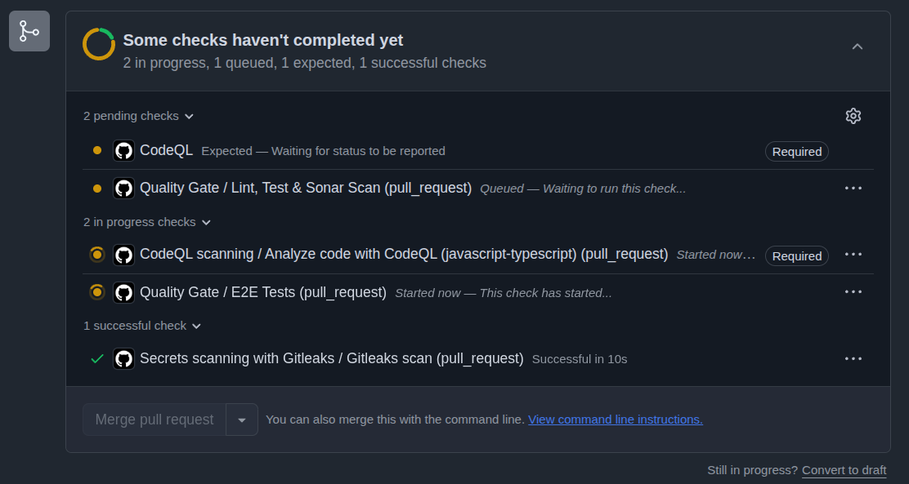

Jako programiści często wpadamy w pułapkę dokładania kolejnych narzędzi i skanerów do naszych pipeline'ów w CI/CD, nie zważając na to, jak mocno wydłuża to czas trwania całego procesu. Chcemy mieć zrobiony linting, przetestowany kod (zarówno jednostkowo, jak i E2E), jakość potwierdzoną przez SonarQube i wreszcie bezpieczeństwo obrazów Dockerowych za pomocą Trivy.

<!-- truncate --> 

Skutek? Z czasem niewinny `git push` kończy się 20-minutowym oczekiwaniem. W dzisiejszym artykule pokażę, jak na żywym organizmie skróciłem czas działania potężnego pipeline'u i wdrożyłem koncepcję "Shift-Left Security" (DevSecOps), rozwiązując przy okazji problem "podwójnego budowania" obrazów.



## 🔴 Zdiagnozowanie Problemu: Przerost formy nad treścią?

W projekcie mieliśmy świetnie pokryty kod i rozbudowany łańcuch dostaw (Supply Chain), ale analiza logów z GitHub Actions ujawniła kilka bolączek:

1. **Wąskie gardło (Wszystko w jednej linii)**: Kroki takie jak sprawdzenie kodu (lint), testy jednostkowe, ciężkie testy Playwright E2E oraz skan SonarQube odbywały się sekwencyjnie. Jeśli lint przeszedł, zaczynały się testy, jeśli testy przeszły – przeglądarka pobierała 1GB binarek, a potem startował Sonar. Trwało to wieczność.
2. **Dublowanie testów E2E**: Testy odpalane na środowisku wirtualnym na GitHubie przy Pull Requestach powtarzały się dokładnie tak samo po wpięciu zmian do głównego brancha `master`.
3. **Prawdziwy grzech główny – Podwójne budowanie Dockera**: Mieliśmy osobny plik `container-scan.yml` i osobny `deploy-staging.yml`. Pierwszy budował obraz tylko po to, by przeskanować go skanerem Trivy, po czym go usuwał. Drugi plik przy deploymencie *znowu* budował ten sam obraz w ciemno i bez skanu wgrywał go na środowisko stagingowe!

## 🟢 Krok 1: Podziel i rządź – Zrównoleglenie Zadań (Parallel Jobs)

Pierwszą optymalizacją było wyrzucenie podejścia sekwencyjnego na rzecz równoległych Jobów w GitHub Actions. Zamiast budować jeden wielki kloc `analyze`, rozbiliśmy go na:

- **Job 1 (Szybki feedback)**: Obejmuje pnpm lint, testy jednostkowe oraz statyczną analizę kodu (SonarQube). Trwa to dosłownie chwilę, dając programiście szybką informację zwrotną.
- **Job 2 (Ciężkie działo)**: Zależności bazy danych, ściągnięcie i zcache'owanie binarek dla przeglądarek (z użyciem `actions/cache`) i pełne testy E2E (Playwright). Dodatkowo zablokowaliśmy uruchamianie powolnych testów dla czystych merge'y do mastera za pomocą warunku: `if: github.event_name == 'pull_request'`. 

Teraz całkowity czas Pipeline'u nie równa się `Czas(Lint) + Czas(Unit) + Czas(E2E)`, lecz po prostu `Max(Czas Szybkich Zadań, Czas E2E)`. Przyspieszenie zauważysz natychmiastowo.

## 🔐 Krok 2: Prawdziwe DevSecOps – Trivy jako strażnik bramy

Zamiast marnować minuty wirtualnych maszyn w GitHub Actions na osobne budowanie kontenerów specjalnie do audytu bezpieczeństwa, połączyliśmy oba procesy w jeden płynny mechanizm deploymentu. Zbudowaliśmy bramkę zabezpieczającą.

Użyliśmy wtyczki `docker/build-push-action`, ale ze zmienioną kluczową flagą: usunęliśmy domyślne oznaczanie z `push: true` i wstawiliśmy parametr `load: true`. 

Sprawia to, że Docker buduje nasz docelowy kontener do pamięci maszyny CI, ale wstrzymuje jego wypchnięcie do publicznego rejestru (GHCR/DockerHub).

Następnie do akcji wkracza Trivy. Przeprowadza pełny skan świeżo zbudowanego obrazu:

```yaml
      - name: Build local image for scan
        uses: docker/build-push-action@v7
        with:
          context: .
          file: apps/api/Dockerfile
          load: true # <--- KLUCZ DO SUKCESU
          tags: |
            ghcr.io/my-org/my-app:staging

      - name: Run Trivy vulnerability scanner
        uses: aquasecurity/trivy-action@master
        with:
          image-ref: "ghcr.io/my-org/my-app:staging"
          format: "table"
          severity: "HIGH,CRITICAL"
          exit-code: "1" # <--- BLOKADA PIPELINE'U
          ignore-unfixed: true

      - name: Push image to registry
        run: docker push ghcr.io/my-org/my-app:staging
```

### Dlaczego `exit-code: "1"` to game-changer?
Parametr ten odgrywa najważniejszą rolę – rzuca statusem błędu krytycznego, jeśli Trivy wykryje niepołatane dziury o stopniu HIGH lub CRITICAL. W efekcie Pipeline ulega awarii, co powstrzymuje proces wdrożenia zanim feralny kod w ogóle dotknie środowiska uruchomieniowego! 

Dopiero w przypadku, gdy Trivy nie zgłosi obiekcji (skan zwróci 0), uruchomi się ostatni krok: prosty skrypt bashowy `docker push`, który natychmiastowo wrzuca prześwietlony plik do rejestru.

Stary `container-scan.yml` stał się niemal całkowicie zbyteczny i można go uruchamiać tylko do celów informacyjnych w Pull Requestach (by znaleźć luki przed fuzją do gałęzi docelowej).

## Podsumowanie

Optymalizacje CI/CD przynoszą ogromne oszczędności (zmniejszenie billingu za GitHub Actions) i uwalniają mnóstwo czasu w zespole projektowym. Przejście z chaotycznego odpalania skryptów do solidnie zaprojektowanego i zrównoleglonego Pipeline'u udowadnia, że bezpieczeństwo (DevSecOps) nie musi stać na przeszkodzie w szybkości dostarczania (Delivery). Może stać się integralnym, chroniącym mechanizmem, w pełni przeźroczystym dla developerskiego trybu pracy.
