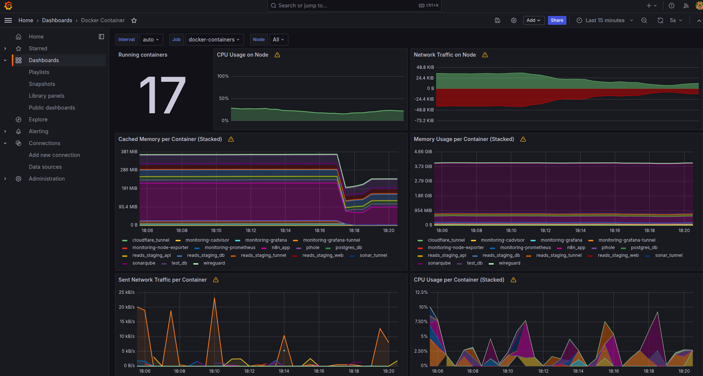

Mam VPS z kilkoma usługami dockerowymi: WireGuard, Pi-hole, n8n, SonarQube, środowisko staging dla mojego projektu. Przez długi czas jedynym "monitoringiem" było SSH i `docker ps`. Postanowiłem to zmienić.

Ten wpis to kopalnia wiedzy z mojego wdrożenia — dowiesz się z niego, jak poprawnie skonfigurować cały stack i jak poradzić sobie z wyzwaniami, które mogą pojawić się w nowoczesnych środowiskach Docker (jak Ubuntu 24.04). To nie jest zwykły tutorial "kopiuj-wklej", ale praktyczny przewodnik po tym, jak sprawić, by monitoring na VPS naprawdę działał.

<!-- truncate --> 

---



## Cel i architektura

Chciałem mieć jedno miejsce, gdzie widzę:

- **metryki hosta** — CPU, RAM, dysk, sieć VPS
- **metryki kontenerów** — co ile żre każdy Docker container
- **dashboard dostępny przez przeglądarkę** za domową domeną

Stack, który wybrałem to klasyczna trójca:

```
Prometheus  →  zbiera i przechowuje metryki
Grafana     →  wizualizuje
Node Exporter + cAdvisor  →  eksportują metryki
```

Całość miała działać jako osobna usługa na VPS — w osobnym katalogu `~/docker-services/monitoring/`, na wzór moich pozostałych usług.

### Topologia sieci

Na VPS mam sieć `secure_net` (`10.6.0.0/24`) — Docker bridge, do której są podłączone wszystkie moje usługi. Każda dostaje stały adres IP z tej puli. Cloudflare Tunnel wystawia poszczególne usługi na zewnątrz bez otwierania portów na firewallu.

```
secure_net (10.6.0.0/24)
├── 10.6.0.2   wireguard
├── 10.6.0.5   pihole
├── 10.6.0.100 sonarqube
├── 10.6.0.105 sonar-tunnel
├── 10.6.0.110 prometheus       ← nowe
├── 10.6.0.111 grafana          ← nowe
├── 10.6.0.112 node-exporter    ← nowe
├── 10.6.0.113 cadvisor         ← nowe
└── 10.6.0.115 grafana-tunnel   ← nowe
```

---

## Konfiguracja

### docker-compose.yaml

```yaml
services:
  prometheus:
    image: prom/prometheus:v2.51.2
    container_name: monitoring-prometheus
    restart: unless-stopped
    extra_hosts:
      - "host-gateway:host-gateway"
    volumes:
      - ./prometheus.yml:/etc/prometheus/prometheus.yml:ro
      - prometheus_data:/prometheus
    networks:
      secure_net:
        ipv4_address: 10.6.0.110

  grafana:
    image: grafana/grafana:10.4.3
    container_name: monitoring-grafana
    restart: unless-stopped
    environment:
      - GF_SECURITY_ADMIN_USER=${GF_ADMIN_USER:-admin}
      - GF_SECURITY_ADMIN_PASSWORD=${GF_ADMIN_PASSWORD}
      - GF_SERVER_ROOT_URL=https://${GRAFANA_DOMAIN}
      - GF_SERVER_DOMAIN=${GRAFANA_DOMAIN}
    volumes:
      - grafana_data:/var/lib/grafana
    depends_on:
      - prometheus
    networks:
      secure_net:
        ipv4_address: 10.6.0.111

  node-exporter:
    image: prom/node-exporter:v1.7.0
    container_name: monitoring-node-exporter
    restart: unless-stopped
    pid: host
    volumes:
      - /proc:/host/proc:ro
      - /sys:/host/sys:ro
      - /:/rootfs:ro
    command:
      - '--path.procfs=/host/proc'
      - '--path.rootfs=/rootfs'
      - '--path.sysfs=/host/sys'
      - '--collector.filesystem.mount-points-exclude=^/(sys|proc|dev|host|etc)($$|/)'
    networks:
      secure_net:
        ipv4_address: 10.6.0.112

  cadvisor:
    image: gcr.io/cadvisor/cadvisor:v0.55.1
    container_name: monitoring-cadvisor
    restart: unless-stopped
    privileged: true
    volumes:
      - /:/rootfs:ro
      - /var/run:/var/run:ro
      - /sys:/sys:ro
      - /sys/fs/cgroup:/sys/fs/cgroup:ro
      - /var/run/docker.sock:/var/run/docker.sock:ro
    command:
      - '--docker_only=true'
      - '--store_container_labels=false'
      - '--whitelisted_container_labels=com.docker.compose.service,com.docker.compose.project'
      - '--housekeeping_interval=30s'
      - '--disable_metrics=disk,network,tcp,udp,percpu,sched,process,referenced_memory,cpu_topology,resctrl'
    networks:
      secure_net:
        ipv4_address: 10.6.0.113

  grafana-tunnel:
    image: cloudflare/cloudflared:latest
    container_name: monitoring-grafana-tunnel
    restart: unless-stopped
    command: tunnel --no-autoupdate run --token ${CF_GRAFANA_TOKEN}
    depends_on:
      - grafana
    networks:
      secure_net:
        ipv4_address: 10.6.0.115

networks:
  secure_net:
    external: true

volumes:
  prometheus_data:
  grafana_data:
```

### prometheus.yml

```yaml
global:
  scrape_interval: 15s
  evaluation_interval: 15s

scrape_configs:
  - job_name: 'vps-infrastructure'
    static_configs:
      - targets: ['monitoring-node-exporter:9100']

  - job_name: 'docker-containers'
    static_configs:
      - targets: ['monitoring-cadvisor:8080']
    metric_relabel_configs:
      - source_labels: [__name__]
        regex: 'container_(cpu|memory|network|blkio|last_seen|health).*'
        action: keep
      - source_labels: [container_label_com_docker_compose_service]
        regex: '.+'
        action: keep
      - source_labels: [container_label_com_docker_compose_service]
        target_label: container_name
```

### .env

```
GF_ADMIN_USER=admin
GF_ADMIN_PASSWORD=silne_haslo_tutaj
GRAFANA_DOMAIN=grafana.twoja-domena.pl
CF_GRAFANA_TOKEN=token_z_panelu_cloudflare
```

---

## Wyzwania techniczne i sprawdzone rozwiązania

To jest kluczowa część tego wpisu. Poniższe kwestie nie są oczywiste, dopóki nie zaczniesz wdrażać monitoringu w specyficznym środowisku produkcyjnym.

---

### Wyzwanie 1: Zarządzanie adresacją IP w Docker network

Podczas iterowania nad konfiguracją, w pewnym momencie zarówno kontener `docker-exporter` jak i `grafana-tunnel` miały przypisany adres `10.6.0.114`. Docker uruchomił oba kontenery bez błędu, ale jeden z nich nie mógł uzyskać adresu — tunel Grafany nie startował, logi były puste.

**Lekcja:** Przy ręcznym zarządzaniu adresami IP w Docker network trzeba prowadzić rejestr zajętych adresów. Ja po prostu mam komentarz na górze każdego `docker-compose.yaml` z zarezerwowanymi IP.

---

### Wyzwanie 2: Obsługa nowoczesnych Storage Driverów (containerd)

To wyzwanie wymagało najgłębszej analizy i pozwoliło mi lepiej zrozumieć ewolucję architektury Dockera.

Objaw: `container_memory_usage_bytes{name!=""}` w Prometheusie zwraca pusty wynik. Jedyna metryka to `id="/"` — root cgroup, bez kontenerów.

W logach cAdvisora powtarzał się komunikat:

```
W manager.go:1169 Failed to process watch event {Name:/system.slice/docker-<hash>.scope}:
failed to identify the read-write layer ID for container "<hash>".
open /rootfs/var/lib/docker/image/overlayfs/layerdb/mounts/<hash>/mount-id: no such file or directory
```

**Diagnoza:** cAdvisor wykrywa kontenery przez cgroupv2 (zdarzenia z `/sys/fs/cgroup/system.slice/`). Kiedy wykryje nowy kontener, próbuje znaleźć jego warstwę read-write w Docker image store — konkretnie plik `mount-id` w strukturze `layerdb`. Jeśli to się nie powiedzie, **pomija kontener i nie zbiera dla niego żadnych metryk**.

Ścieżka której szuka: `/rootfs/var/lib/docker/image/overlayfs/layerdb/mounts/<container-id>/mount-id`

**Przyczyna:** Docker 29.x na Ubuntu 24.04 domyślnie używa **containerd image store** (`io.containerd.snapshotter.v1`) zamiast tradycyjnego overlay2. W tym trybie struktura `layerdb/mounts/` po prostu nie istnieje — Docker deleguje zarządzanie warstwami do containerd.

Sprawdzenie:

```bash
docker info | grep "Storage Driver"
# Storage Driver: overlayfs   ← to wskazuje containerd snapshotter

ls /var/lib/docker/image/
# identity-cache.db   ← tylko ten plik, brak overlay2/ ani overlayfs/
```

**Próbowane rozwiązania, które NIE zadziałały:**
- `prometheusnet/docker_exporter` — zwracał `400 Bad Request` z Docker API
- cAdvisor v0.47.2, v0.49.1, v0.50.0 z flagami `--docker_only`, `--disable_metrics` — te same błędy
- `--containerd=/run/containerd/containerd.sock --containerd-namespace=moby` — nie pomogło, bo błąd jest w innej ścieżce kodu (cgroupv2 watch events, nie kontener discovery)

**Rozwiązanie:** Upgrade cAdvisor do **v0.55.1**.

```bash
docker run --rm gcr.io/cadvisor/cadvisor:latest --version
# cAdvisor version v0.55.1
```

W v0.55.1 naprawiono obsługę Docker + containerd snapshotter. Logi po uruchomieniu — czyste, zero warningów o `read-write layer`.

---

### Wyzwanie 3: Czytelność danych — Mapowanie nazw kontenerów

Po naprawieniu zbierania metryk, dashboard w Grafanie wyświetlał w legendzie ciągi jak `06e7f1e49514f1d7770c21828c8278382eeb...` zamiast `monitoring-grafana`, `n8n_app`, `pihole`.

**Diagnoza:** Label `name` w cAdvisor był ustawiony na container ID (hash), nie na Docker container name. Przyczyna: flaga `--containerd-namespace=moby` powodowała, że cAdvisor używał containerd API do odkrywania kontenerów — a w kontekście containerd, "name" kontenera to jego ID, nie przyjazna nazwa z Dockera.

Dodatkowo — w danych Prometheusa były duplikaty: każdy kontener występował dwa razy (raz z hashem, raz z prawdziwą nazwą), bo cAdvisor odkrywał kontenery zarówno przez cgroupv2 jak i przez Docker API.

**Rozwiązanie:**

1. Usunięcie flagi `--containerd-namespace=moby` — Docker API poprawnie resolves nazwy kontenerów
2. Dodanie `--whitelisted_container_labels=com.docker.compose.service,com.docker.compose.project` — eksportuje labele compose jako Prometheus labels
3. W `prometheus.yml` — filtr i relabeling:

```yaml
metric_relabel_configs:
  # Odrzuć metryki bez labela compose (duplikaty z cgroupv2 bez nazw)
  - source_labels: [container_label_com_docker_compose_service]
    regex: '.+'
    action: keep
  # Stwórz label container_name z nazwy usługi compose
  - source_labels: [container_label_com_docker_compose_service]
    target_label: container_name
```

Po tej zmianie: 17 kontenerów, każdy z czytelną nazwą.

---

## Wynik

Dashboard w Grafanie pokazuje:

- Memory usage per container (MB): `sonarqube 3.2GB`, `n8n_app 570MB`, `reads-api 115MB`...
- CPU usage per container
- Host metrics: CPU, RAM, load average, disk I/O
- Dostępne przez `https://grafana.baluarte.pl` przez Cloudflare Tunnel, bez otwartych portów na firewallu

Gotowe zapytania Prometheus po tej konfiguracji:

```promql
# RAM per kontener
sum(container_memory_usage_bytes{container_name!=""}) by (container_name)

# CPU per kontener (5-minutowa średnia)
sum(rate(container_cpu_usage_seconds_total{container_name!=""}[5m])) by (container_name)

# Czy kontener żyje
container_last_seen{container_name!=""} > 0
```

Dashboardy do importu w Grafanie:
- **ID 1860** — Node Exporter Full (metryki hosta)
- **ID 11600** — Docker Container & Host Metrics (używa `container_name`)

---

## Kluczowe wnioski

**1. Sprawdź wersję Dockera przed doborem narzędzi.**  
Docker 24+ z containerd snapshotter to inna architektura niż "klasyczny" Docker. cAdvisor ≤ v0.50 nie obsługuje tej kombinacji. Wersja v0.55.1 działa.

**2. cAdvisor nie potrzebuje dostępu sieciowego do kontenerów.**  
Czyta metryki przez cgroupv2 i Docker socket — izolacja sieciowa kontenerów nie ma znaczenia dla monitoringu.

**3. Dokładna weryfikacja zbieranych danych.**  
Prometheus może zgłaszać targety jako `up`, nawet jeśli dane są zduplikowane lub niepełne. Warto poświęcić chwilę na ręczne sprawdzenie kluczowych metryk (np. `container_memory_usage_bytes`), aby upewnić się, że dashboardy będą rzetelne.

**4. `metric_relabel_configs` to właściwe miejsce na filtrowanie.**  
Nie próbuj filtrować przez flagi cAdvisora tego, co można wyczyścić w Prometheusie na etapie ingestion. Relabeling w Prometheusie daje pełną kontrolę nad tym, co trafia do TSDB.

---

## Stack końcowy

| Komponent | Obraz | Wersja |
|---|---|---|
| Prometheus | `prom/prometheus` | v2.51.2 |
| Grafana | `grafana/grafana` | 10.4.3 |
| Node Exporter | `prom/node-exporter` | v1.7.0 |
| cAdvisor | `gcr.io/cadvisor/cadvisor` | **v0.55.1** |
| Cloudflare Tunnel | `cloudflare/cloudflared` | latest |

Pełna konfiguracja dostępna w repozytorium: [vps-homelab/docker-services/monitoring](https://github.com/przemyslvw/vps-homelab)
