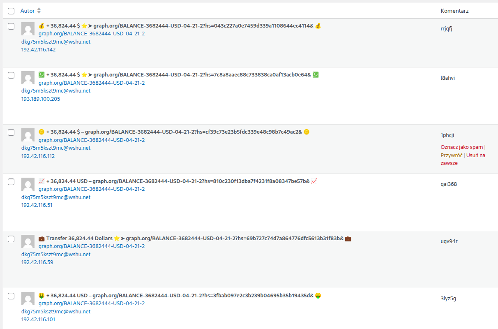

Dzisiaj rano mój blog stał się celem zautomatyzowanego ataku typu **Comment Spam / Black Hat SEO**. Botnet próbował masowo wstrzykiwać do bazy danych wpisy promujące finansowe wyłudzenia (scam) oraz linki mające sztucznie budować profil PageRank docelowych domen.

<!-- truncate -->

Wdrożenie skutecznej ochrony zajęło dokładnie minutę. Wychodzę z założenia, że dobre zabezpieczenia opierają się na poprawnej architekturze, a nie na ukrywaniu konfiguracji (_security through obscurity_). Bezpieczne rozwiązania można, a nawet warto podawać publicznie do wiadomości – profesjonalna konfiguracja obroni się sama, w przeciwieństwie do rozwiązań prowizorycznych.

Poniżej przedstawiam instrukcję, jak krok po kroku wdrożyć taką ochronę u siebie, odcinając boty na brzegu sieci, zanim w ogóle obciążą serwer.

---

## Dlaczego tradycyjne wtyczki to za mało?

Większość botów spamujących uderza bezpośrednio w plik obsługujący komentarze, generując zapytania HTTP POST bezpośrednio do endpointu. Przetwarzanie tych żądań przez WordPressa (uruchamianie silnika PHP, odpytywanie bazy danych i działanie wtyczek filtrujących) niepotrzebnie zużywa zasoby serwera.

Podejście **Secure by Design** wymaga, aby ruch odfiltrować na poziomie proxy (CDN), zanim pakiet dotrze do serwera origin.

---

## Instrukcja wdrożenia: Blokada w Cloudflare WAF

Jeśli Twoja domena jest podpięta pod Cloudflare, możesz utworzyć precyzyjną regułę firewall (WAF), która zabezpiecza formularz, nie wpływajac jednocześnie na działanie zewnętrznych integracji czy API (np. n8n działającego na `/wp-json/`).

### Krok po kroku:

1. Zaloguj się do panelu Cloudflare i wybierz swoją domenę.
2. W lewym menu przejdź do sekcji **Security** -> **Security rules** (lub _WAF_ w zależności od wersji interfejsu).
3. W zakładce _Custom rules_ kliknij przycisk **Create rule**.
4. Skonfiguruj warunki w sekcji _When incoming requests match_:

- **Field:** `URI Path`
- **Operator:** `equals`
- **Value:** `/wp-comments-post.php`

5. W sekcji _Then take action_ (**Choose action**) wybierz: **Managed Challenge**.
6. Kliknij **Deploy** w prawym dolnym rogu.

### Jak to działa w praktyce?

Cloudflare uruchamia w tle szybką, bezwiedną dla człowieka weryfikację JavaScript. Prawdziwy użytkownik, który chce zostawić komentarz na blogu, przechodzi walidację automatycznie. Zautomatyzowany skrypt (bot) nie jest w stanie wykonać testu JS i zostaje natychmiast zablokowany na serwerze proxy.

---

## Druga linia obrony: Czarna lista wewnątrz WordPressa

Jako uzupełnienie ochrony warto skonfigurować wbudowany mechanizm filtrowania treści w samym WordPressie. Pozwoli to wyłapać zapytania, które próbowano by przesłać inną drogą.

1. Przejdź do kokpitu WP: **Ustawienia** -> **Dyskusja**.
2. Znajdź sekcję **Klucze czarnych list komentarzy** (Comment Blacklist).
3. Wklej powtarzające się frazy lub domeny, które pojawiają się w logach spamu (np. `graph.org`).

Każdy komentarz zawierający te słowa w treści, nazwie autora czy adresie e-mail zostanie automatycznie i trwale usunięty, zamiast trafiać do kolejki moderacji. Wykorzystując synergię Cloudflare oraz lokalnych reguł systemu, problem masowego spamu zostaje całkowicie rozwiązany bez spadku wydajności witryny.
